Recently I launched [aviationdocs.net](https://aviationdocs.net)! This is a website that is meant to function like other AI chat applications (chatgpt, gemini, claude, etc.) except it is trained to use aviation documents and return the place in these documents that the answer comes from so that a pilot can verify what answer they were given. If you're not a pilot then the [about page](https://aviationdocs.net/about) can show you some examples of how you might interact with the website.

# Background

To go into a little bit more detail on what need this is trying to serve let's talk about what is required to be a Private Pilot in the United States.  

In general what we are looking at for this project is the 2nd bubble: "Aeronautical Knowledge". While you can probably learn how to fly a plane purely through repitition and skip theory like what generates lift and understanding why the plane has a tendency to turn (usually to the left) it's probably helpful to know these things. Also, it is tested. The final test, called the "Checkride" is a a 2 part test: the first part is a 1-2.5 hour oral section where the examiner asks you a bunch of questions about the flight you're about to take and sprinkles in some trick questions to test your understanding of regulations and theory. The final 1.5-2 hours is the actual flying portion if you pass the oral. There is also a written test that every private pilot must pass, though you only need a 70% to pass and it is multiple choice. That being said it isn't a test you can just take without studying and whatever you miss on the written test will be guaranteed to come up in the oral so it's advised that you get as high a score as possible to keep the oral as short as possible.

Now what do you study as a private pilot? There are a documents that are really the size of textbooks. 

## Pilot Handbook of Aeronautical Knowledge (PHAK)

By far the most important one and generally what curriculums are built on is the [PHAK](https://www.faa.gov/regulations_policies/handbooks_manuals/aviation/phak). This massive textbook goes over airplanes from their history, controls and physics, weather considerations, navigation planning, maneuvers, and how to evaluate yourself and your plane for flight readiness. It also mentions some regulations that are part of the Federal Aviation Regulations but isn't an up to date source for regulations.

## Airplane Flying Handbook (AFH)

The [AFH](https://www.faa.gov/regulations_policies/handbooks_manuals/aviation/airplane_handbook) is used to explain how to actually fly the plane. Where the PHAK will focus more on theory and give a high level view of flying the AFH is to understand how to physically fly the plane such as during different phases of flight (takeoff, landing, cruise), or how to perform a specific maneuver. The PHAK is more about the 'why' and 'what' of aviation concepts, whereas the AFH focuses on the 'how' and 'when'.

## Federal Aviation Regulations (FAR)

The [FAR](https://www.ecfr.gov/current/title-14) is an ever evolving document that lists ALL the regulations that pilots must follow. There are a lot of parts and generally you wouldn't memorize the whole thing except for select regulations that would be good to know, for example section 61 and 91 pertain to earing a pilot certificate and all pilots respectively. However, if there's ever a question into what is legal related to aviation, this is where you will find the answer, so it's a very important document to have access to.

## Pilot Operating Handbook (POH)

The POH is a handbook that is unique to each model of plane, so there is no "One Document" to link here. Rather you would read the POH for the plane that you are training on, which for most people is probably a Cessna 172 (I started on a 162 before switching to a 172). Here is an [example POH](https://www.befa.org/wp-content/uploads/2019/12/POH-Cessna-172S.pdf). Generally they are all structured the same and have the same 9 sections but could have different appendices based on what has been installed or replaced. The POH is where you will find information on how your specific plane is built and the mechanical and electronic systems work and what speeds and conditions the plane can handle. For example, The PHAK and AFH will talk about manuevers and how to fly them but will say that you need to fly at *V_a* or the *maneuvering speed*. Or it will outline how to handle an emergency engine out situation and tell you that you would need to fly at *V_g* or *best glide speed*. The POH would tell you what *V_a* and *V_g* are in knots, for example for the 172 I've been flying the *V_a* is from 90-102 knots depending on passenger + baggage weight while *V_g* is 68 knots.

Given that plane model is different it's imperative to read the POH and understand how your specific plane is built and what speeds to fly it at.

## Airman Certification Standards (ACS)

There are different ACS documents that outline the requirements that a pilot must demonstrate for the certification they are being tested for. For example, this is the [Private Pilot ACS](https://www.faa.gov/training_testing/testing/acs/private_airplane_acs_6.pdf). It's mostly for examiners but it's good for students to understand as it lists the exact things they should be able to show for each maneuver/knowledge item for the Checkride.

# Why Build This?

So now that you have an idea of all the documents that aid a private pilot you can probably see that it's a lot. There's many things that a private pilot would be able to memorize and pick up as they're flying, for example once you start flying and understanding how the airplane moves the theoretical concepts behind the forces of flight are easier to comprehend. These concepts would at most just need a quick refresher for a pilot that hasn't studied the exact wording of a text book in a while. But there are a lot of things to memorize that more esoteric/specific numbers

* Airspace and Visibility requirements
* Maintenance required for a plane to be "airworthy" and their windows
* The different acronyms for decision making

It's like how programmers need to google "How to center a div". It's supposed to be basic and you think you know how to do it but then when you need to you double check. Generally it's ill-advised to google for aviation related questions, ESPECIALLY if it's for a regulation and examiners/instructors would prefer if you do use google that you find the answer on a reputable site, e.g. https://faa.gov. But what if you could use something similar to google, i.e. use natural language rather than Ctrl + F a textbook to find your query and know that your answer will be from the FAA docs? That's what this is meant to be! A more reliable form of "Googling" where the answers will come straight from the FAA sources AND it will link to the pages in those sources so you can verify the information for yourself!

At the time I built this I was interested in AI and wanted to build something with it and understand better how "AI"/LLMs work and their capabilities. This is a perfect use case of an Retrieval-Augmented Generation (RAG) LLM and so I got to work.

# The Tech Stack

## LLM

Let's start with the LLM since the rest of the stack is more "standard" and most programmers would likely understand it without going into too much explanation but LLMs are a bit newer. As I mentioned this was a great use case for a RAG LLM.

```mermaid
graph LR
    A[📝 Question] --> B[🔍 Retrieval System]
    B --> C[📄 Relevant Documents]
    C --> D[🧠 LLM Model]
    D --> E[💬 Answer]
    
    subgraph "1. Retrieval"
        B
    end
    
    subgraph "2. Generation"
        D
    end
    
```

The basic idea of a RAG LLM is to use an LLM's ability to understand language and generate sentences/answer and pair it with highly specific context for generating those answers. In this case we would take a users's question, e.g. "What is the best glide speed on the Cessna 172?" and using ONLY documents provided to the LLM it would find the relevant section in one of the documents and answer something like "The best glide speed for a Cessna 172 is 68 knots with all flaps up" and then provide a link to the place where it found this information. If it fails to find relevant information it should respond "I don't know". The key concept here is that we can use a pre-trained LLM (for example gpt-4 or gemini-2.5) and have it only provide answers based on specific input information.

```mermaid
graph TD
    A[📚 Input Documents] --> B[✂️ Chunk Documents]
    B --> C[🔢 Generate Embeddings]
    C --> D[💾 Store in Vector DB]
    
    E[❓ User Query] --> F[🔢 Query Embedding]
    F --> G[🔍 Similarity Search]
    D --> G
    G --> H[📄 Relevant Chunks]
    H --> I[🧠 LLM with Context]
    I --> J[💬 Generated Answer]
    
    subgraph "Offline Processing"
        A
        B
        C
        D
    end
    
    subgraph "Query Time"
        E
        F
        G
        H
        I
        J
    end
    
```

This diagram provides more detail for those curious about the specific RAG workflow:

1. **Take in the input documents** - Load aviation handbooks, regulations, etc.
2. **Chunk them** - Break documents into smaller pieces with configurable size and overlap
3. **Generate embeddings** - Use an embedding algorithm to convert text into vectors
4. **Store in vector database** - Save embeddings for fast similarity search
5. **Process user query** - Convert the question into the same vector space
6. **Similarity search** - Find document chunks most relevant to the query
7. **Feed context to LLM** - Provide relevant chunks as context
8. **Generate answer** - LLM responds using ONLY the provided documents

## Rest of the Stack

In general the website is built with Django (Python) and uses Docker to interact with PostgreSQL for storage and ChromaDB for vector embedding storage. S3 is used for storing users documents and we currently use gemini-2.5 for embedding + the LLM however this is subject to change. The diagram below shows the basic setup. It's currently all on my lightsail server which might not be the most scalable solution at the moment but it's cheap and easy to understand and an optimization for later.

```mermaid
graph TB
    subgraph "AWS Lightsail Instance"
        subgraph "Reverse Proxy Layer"
            Caddy["🌐 Caddy Server<br/>SSL Termination<br/>HTTPS/Domain Routing"]
        end

        subgraph "Docker Container Stack"
            Django["🚀 Django Web App<br/>Gunicorn + Django 5.2<br/>"]
            DB["🗃️ PostgreSQL 17<br/>Primary Database<br/>"]
            Vector["📊 ChromaDB Vector Store<br/>Client-Server Mode<br/>"]
            Monitor["🏥 Autoheal Container<br/>Health Monitoring"]
        end
    end

    subgraph "External Services"
        S3["☁️ AWS S3<br/>faa-ai-prod bucket<br/>Document Storage"]
        Gemini["🧠 Google Gemini API<br/>LLM + Embeddings<br/>gemini-2.5-flash"]
        VT["🛡️ VirusTotal API<br/>Antivirus Scanning"]
    end

    Users["👥 Users<br/>aviationdocs.net"] --> Caddy
    Caddy --> Django
    Django --> DB
    Django --> Vector
    Django --> S3
    Django --> Gemini
    Django --> VT
    Monitor --> Django
    Monitor --> DB
    Monitor --> Vector

```

The LLM portion of this post talked about generally flow of querying but here is a diagram for visual learners.

```mermaid
graph TD
    User["👤 User"] --> QueryForm["📝 Query Form<br/>Django Template"]
    QueryForm --> RateLimit["⚡ Rate Limiting<br/>Request Validation"]
    RateLimit --> Auth["🔐 User Authentication<br/>Permission Check"]
    Auth --> DocFilter["📄 Document Filtering<br/>User-specific Access"]

    DocFilter --> VectorSearch["🔍 Vector Search<br/>ChromaDB Similarity<br/>Distance Cutoffs"]
    VectorSearch --> ContextRetrieval["📚 Context Retrieval<br/>Document Chunks"]

    ContextRetrieval --> LangGraph["🔄 LangGraph Pipeline"]

    subgraph "LangGraph RAG Processing"
        LangGraph --> QueryProcess["🧠 Query Processing"]
        QueryProcess --> RelevanceScore["📊 Relevance Scoring"]
        RelevanceScore --> GeminiAPI["🚀 Google Gemini API<br/>Answer Generation"]
        GeminiAPI --> SourceAttrib["📎 Source Attribution"]
    end

    SourceAttrib --> ResponseAssembly["📋 Response Assembly<br/>Formatted Answer"]
    ResponseAssembly --> JSONResponse["💾 JSON Response"]
    JSONResponse --> Frontend["🖥️ Frontend Display"]
    Frontend --> User

    subgraph "Data Sources"
        ChromaDB["📊 ChromaDB<br/>Vector Embeddings"]
        Documents["📚 FAA Documents<br/>S3 Storage"]
    end

    VectorSearch --> ChromaDB
    ContextRetrieval --> Documents

```

Also here is a diagram for the upload document flow for those curious.

Overall the tech stack isn't anything crazy. Django was amazing a quick way to get pages running and working while PostgreSQL was chosen as I worked with it before professionally and there isn't a reason to not use it.

# Future Improvements

There are a few things that need to be improved.

1. **Make Document Upload Process Async** - Currently if you upload the document and it fails at any part: S3 upload, antivirus, embedding, it is just considered failed and changes are rolled back. Ideally we would use a separate processing service for this. I didn't think this was *necessary* to add at the moment but I know django has the ability to plug into a tool like **celery** for background jobs. So I'd love to tackle that, I've never implemented worker processes before so it would be new for me!
2. **Evaluate Models** - One of the hardest things to do with the subjective and non-deterministic natures of LLMs is to quantify how well they perform. It would be good to have metrics for this and an easy easy to judge if this is getting better or worse.
3. **More preprocessing for specific documents** - If you noticed the ACS and FAR are not documents available to query at the moment. This is because the embedding models are not very good at understanding how they are structured and without any preprocessing querying those documents sucks. This should not be difficult to fix, probably could use another AI to preprocess it.

# Learnings

1. **Agentic AI Workflow** - I haven't mentioned this at all before but probably the biggest learning has been learning how to leverage an AI agent (Claude in this case). This project started with me hand-rolling my code and it was great to setup the RAG pipeline by hand to reinforce the ideas but once I had my PoC done and wanted to add the actual website scaffolding with Django I leaned more and more into Claude until now basically this whole project is AI code. It's actually incredible how fast this was done, It's taken about 1 month to build this project and it would have taken at least 3x more if I did it myself (especially the front end) and it wouldn't have some of the features it has such as the security headers policies and antivirus (I didn't even think of adding that). AI agents aren't perfect but with good prompting and context handling they're incredibly fast at coding and generally it getting a first draft out, and revising the code 2 times is faster than my first draft.
2. **RAG** - I learned how a RAG LLM works! In general when I see LLMs it seems like this kind of LLM is generally the best kind of LLM you can get. I'm not a person that think that LLMs will bring about ASI rather I think applications of LLMs like RAG are pretty much perfect use cases for LLMs and they don't need to be more than that.
3. **SaaS** - This is the first thing I've built that I'd call a SaaS. Soon I'll be pushing some ads and seeing if anyone will use it but if I get one person to like it it'll be a success. Right now this setup costs me $30-40 / month (lightsail + SSDs + S3 + LLM APIs) and I don't see it taking much more unless a lot of people start using it. If it gets more expensive or reoccurring users then I can think of actually putting in monetization (I have some ideas) but at the moment I'm proud just to have built something that looks and functions like a professional SaaS product.

I'm taking a bit of a break from this project but plan to come back to it. Hopefully if you read this you can check out https://aviationdocs.net and maybe it has some new, cool features available!!